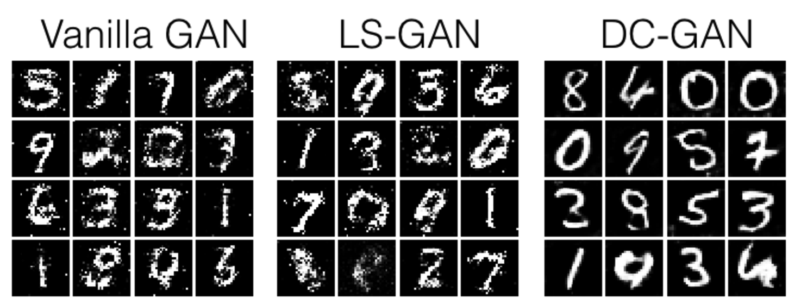
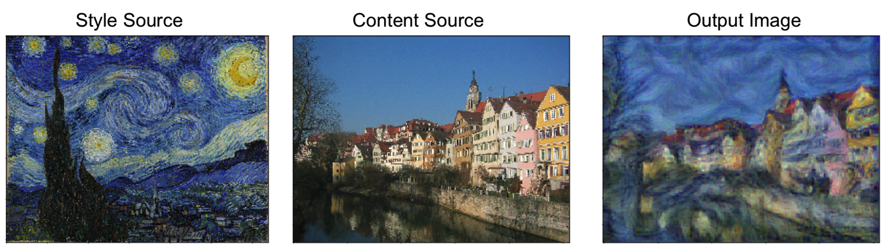
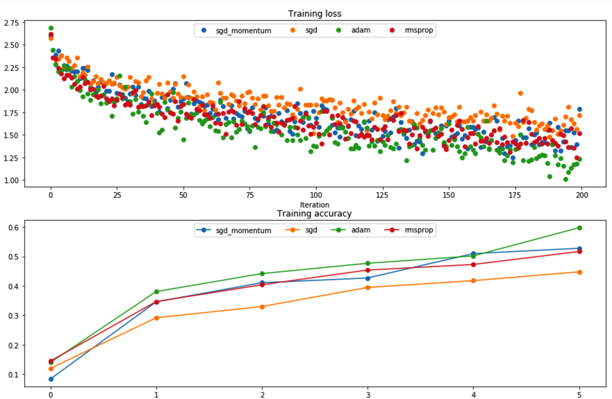
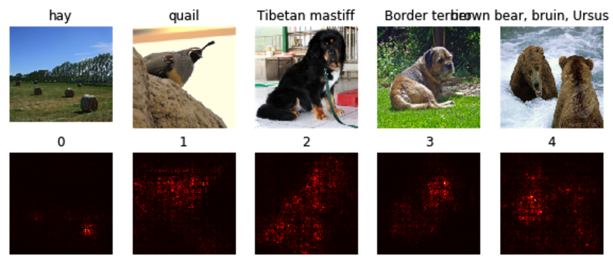
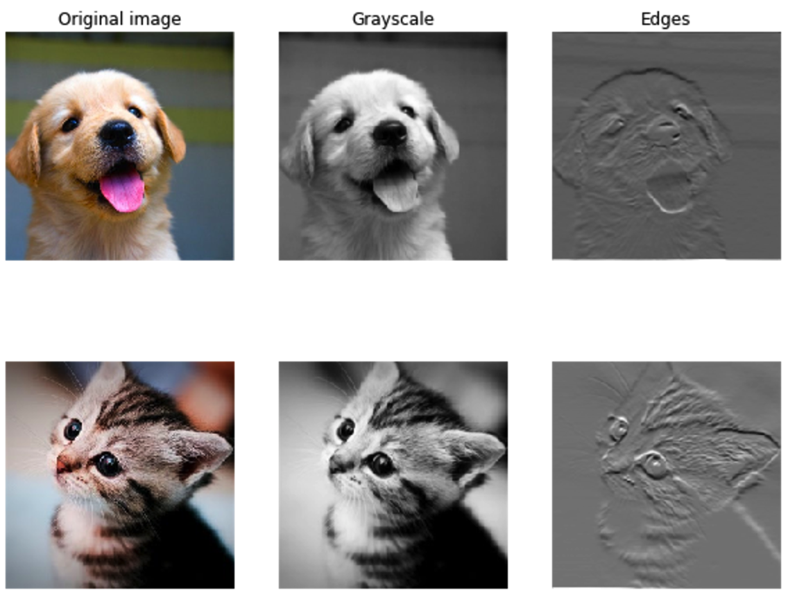

# CS231N
### Stanford CS231N Convolutional Neural Networks for Visual Recognition

### Course Assignments

__Generative Adversal Network__

__Style Transer__

__Optimizers__

__Salient Maps__

__Feature Etraction__

### Final Project